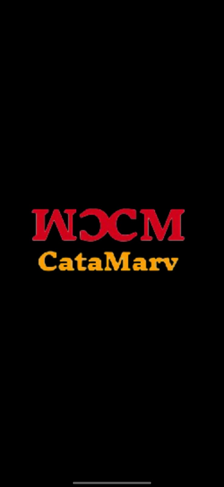
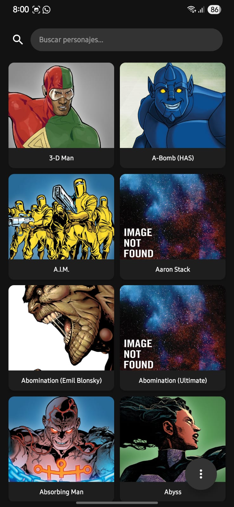
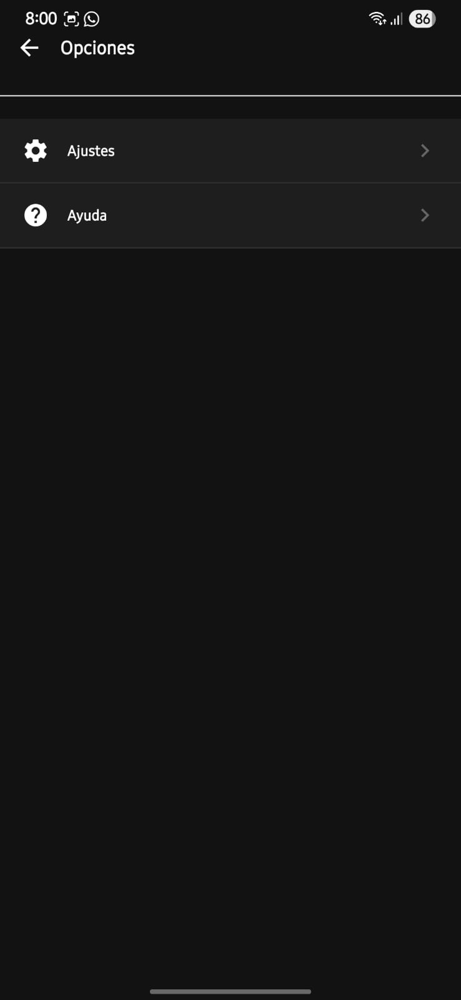
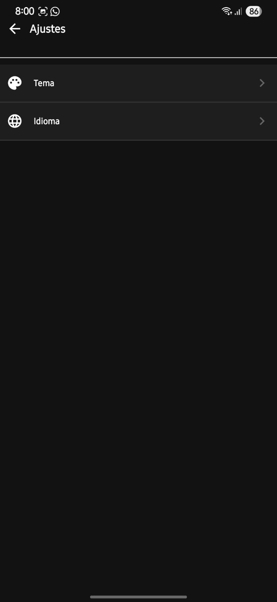
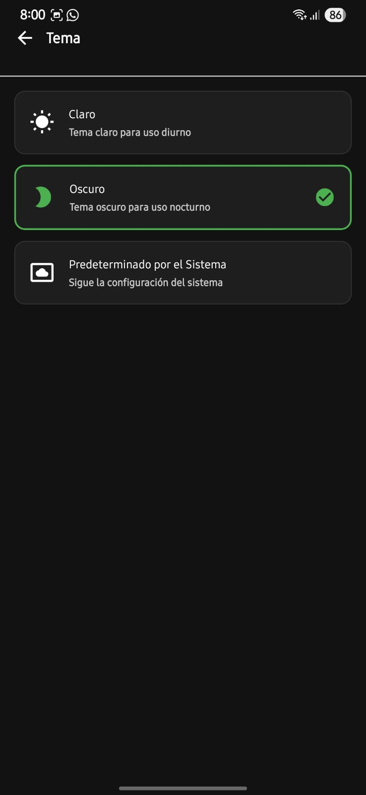
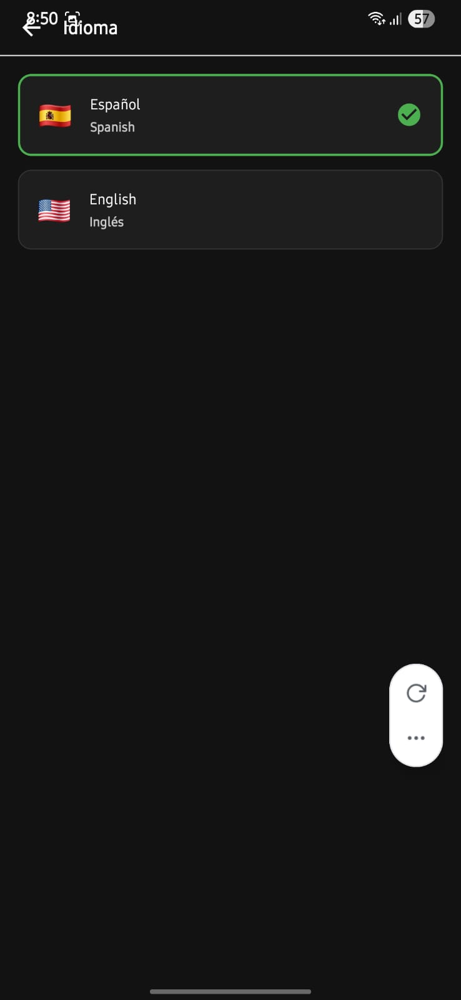
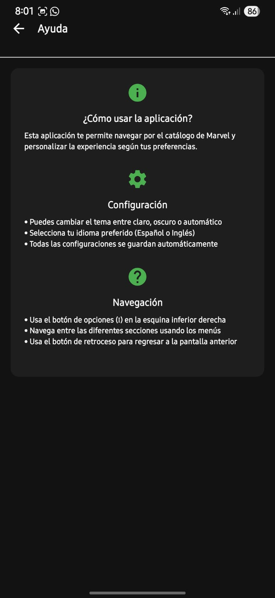

# 📽️ Catálogo de los Personajes de Marvel  

## 1. Introducción  
El presente documento describe la aplicación móvil **Catálogo de los Personajes de Marvel**, diseñada para ofrecer a los usuarios un acceso organizado y actualizado al universo cinematográfico de Marvel (MCU).  
La aplicación proporciona información detallada de cada producción, incluyendo título, fecha de estreno, sinopsis, elenco y orden cronológico, constituyéndose como una herramienta de consulta tanto para aficionados como para investigadores del cine contemporáneo.  

---

## 2. Objetivo  
El objetivo principal de la aplicación es **centralizar y facilitar el acceso a la información de los Personajes de Marvel**, mediante una interfaz intuitiva, con soporte para búsquedas avanzadas y opciones de personalización como listas de favoritos y modo oscuro.  

---

## 3. Alcance  
La aplicación está dirigida a:  
- Estudiantes y docentes de cine y comunicación.  
- Aficionados al universo Marvel.  
- Usuarios interesados en contar con un catálogo digital actualizado y estructurado.  

El sistema incluye:  
- Catálogo de películas con información detallada.  
- Búsqueda y filtrado por título, año o personaje.  
- Organización en orden cronológico y de estreno.  
- Funcionalidad de marcadores o favoritos.  

---

## 4. Tecnologías utilizadas  

| Componente              | Herramienta / Tecnología |
|--------------------------|--------------------------|
| Framework principal      | React Native (Expo) / Flutter |
| Lenguaje de programación | JavaScript / TypeScript (React Native) o Dart (Flutter) |
| API externa              | The Movie Database (TMDB) |
| Gestión de estado        | Redux Toolkit / Provider / Riverpod |
| Navegación               | React Navigation / Flutter Navigator 2.0 |
| Interfaz gráfica         | Styled Components, Tailwind CSS o Material Design 3 |

---

## 5. Estructura del proyecto  

```
Catálogo-Marvel/
│
├── assets/              # Recursos gráficos e íconos
├── contexts/            # Contexto del tema y lenguaje de la aplicación
├── src/
│   ├── api/             # Conexiones a la API externa
│   ├── components/      # Componentes visuales reutilizables
│   ├── screens/         # Vistas principales (Inicio, Detalle, Favoritos)
│   ├── services/        # Servicios de los detalles de cada personaje de Marvel
│
├── App.js / main.dart   # Punto de entrada de la aplicación
├── package.json / pubspec.yaml
└── README.md
```

---

## 6. Instalación y despliegue  

### 6.1 React Native (Expo)  
```bash
git clone https://github.com/angeldejesusbp2-cmd/CatalogoMarvel
cd marvel-catalogo
npm install
npx expo start
```

### 6.2 Flutter  
```bash
git clone https://github.com/angeldejesusbp2-cmd/CatalogoMarvel
cd marvel-catalogo
flutter pub get
flutter run
```

---

## 7. Capturas de Pantalla
### 7.1 Captura de pantalla sobre el logo de la aplicacion.



### 7.2 Captura de pantalla sobre el inicio de la aplicacion.



### 7.3 Captura de pantalla sobre las opciones de la aplicacion.



### 7.4 Captura de pantalla sobre los ajustes de la aplicacion.


  

### 7.5 Captura de pantalla sobre las opciones del tema de la aplicacion.



### 7.6 Captura de pantalla sobre las opciones del idioma de la aplicacion.



### 7.7 Captura de pantalla sobre las opcion de ayuda de la aplicacion.



## 8. Plan de mejoras (Roadmap)  
- Inclusión de series de Marvel Studios.  
- Integración de trivia, datos curiosos y “easter eggs”.  
- Sistema de recomendaciones personalizadas.  
- Implementación de almacenamiento local para modo offline.  

---

## 9. Contribuciones  
Se aceptan contribuciones bajo un modelo de **pull requests**.  
Para colaborar:  
1. Realizar un **fork** del repositorio.  
2. Crear una rama de desarrollo (`feature/nueva-funcionalidad`).  
3. Implementar y documentar los cambios.  
4. Abrir un **pull request** para su revisión.  

---

## 10. Licencia  
El proyecto se distribuye bajo la licencia **MIT**, lo que permite su uso, modificación y distribución, siempre y cuando se mantenga el reconocimiento a los autores originales.  
